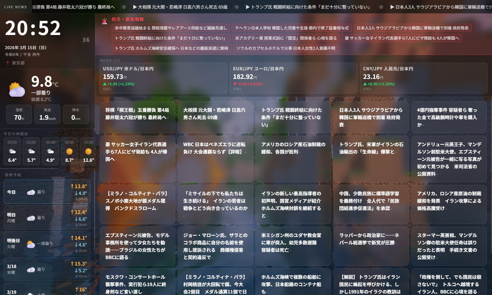

# 📡Hiroba News Smart Monitor

**本ソフトは[ABATBeliever氏](https://github.com/ABATBeliever)の[Hiroba News Smart Monitor](https://github.com/ABATBeliever/Hiroba-News-Smart-Monitor)のforkです。**

リアルタイムで天気・ニュース・防災情報を1画面に表示する、
超軽量ローカル Web ダッシュボードです。  



---

## 起動方法

```
python run.py
```
または、
```
python3 run.py
```
または、
```
uv run main.py
```

ブラウザで `localhost:8888` を開くと起動します。

---

## コマンドライン引数

| 引数 | デフォルト | 説明 |
|------|-----------|------|
| `--city` | `東京都` | 天気エリアの表示名 |
| `--lat` | `35.6895` | 緯度 |
| `--lon` | `139.6917` | 経度 |
| `--port` | `8765` | ポート番号 |
| `--rss URL ...` | なし | RSSフィードを追加（複数可） |
| `--no-default-rss` | なし | デフォルトRSSを無効化 |
| `--compact-clock` | なし | 時計フォントを縮小（時計がはみ出てしまう場合に仕様） |
| `--mouse-hide` | なし | マウスカーソルを非表示にする（タッチパネル端末向け） |
| `--wake-lock` | なし | 画面が暗くなるのをWakeLockAPIを利用し阻止するよう試行する |

### 使用例

```bash
# 大阪・ポート8080の例
python run.py --city 大阪 --lat 34.6937 --lon 135.5023 --port 8080

# RSSフィードを追加
python run.py --rss https://example.com/feed.xml

# デフォルトRSSを無効にして独自フィードのみ
python run.py --no-default-rss --rss https://example.com/feed.xml

# タッチパネル端末向け（カーソル非表示・画面が暗くなるのを防止するよう試行）
python run.py --mouse-hide --wake-lock

# 小型Linux端末向け（時計縮小・全オプション）
python run.py --compact-clock --mouse-hide
```

### 主要都市の緯度経度

| 都市 | `--lat` | `--lon` |
|------|---------|---------|
| 札幌 | 43.0618 | 141.3545 |
| 仙台 | 38.2682 | 140.8694 |
| 東京 | 35.6895 | 139.6917 |
| 横浜 | 35.4478 | 139.6425 |
| 名古屋 | 35.1815 | 136.9066 |
| 京都 | 35.0116 | 135.7681 |
| 大阪 | 34.6937 | 135.5023 |
| 神戸 | 34.6913 | 135.1830 |
| 広島 | 34.3963 | 132.4596 |
| 今治 | 34.0664 | 133.0077 |
| 高松 | 34.3401 | 134.0434 |
| 福岡 | 33.5904 | 130.4017 |
| 那覇 | 26.2124 | 127.6809 |

> **Google Maps** で右クリック → 座標を取得可能

---

## 機能詳細

### 🕐 時刻エリア（左上）
- 24時間表記、秒単位リアルタイム更新（コロン点滅）
- 西暦・和暦（令和）・干支（例：乙巳）を同時表示
- 設定都市名を表示

### 🌤 天気エリア（左）
- **気象データ：** [Open-Meteo API](https://open-meteo.com/)
- 現在の気温・体感温度・天気説明・湿度・風速・降水量
- 3時間刻みの時間予報（8コマ）— 週間予報と独立したエリアに表示、横ドラッグスクロール対応
- 7日間の週間予報（最高/最低気温・降水量）— 縦ドラッグスクロール対応
- **更新間隔：** 10分ごと

### 🗞️ニュースフィード (上)
- **デフォルトRSS：** NHK主要・BBC日本語・CNN Japan
- ホバーで一時停止、クリックで無効

### 📅 時間割変更表示（右）
- 電波ポータルから取得 (APIはSchedule_change_serverを使用)
- タイル型グリッド表示、右エリアで独立スクロール（マウスドラッグ・タッチスワイプ対応）
- 表示が収まらない場合は自動スクロール
- **更新間隔：** 5分ごと

### 🚨 防災バナー（右上）
- 気象庁緊急情報XMLを監視
- 香川県・岡山県のH27のみ取得
- 情報あり：赤バナーでアイテム表示
- 情報なし：緑の「現在、香川県・岡山県に防災情報はありません」表示
- **更新間隔：** 3分ごと

### 🖼 背景画像
- Schedule_change_serverを起動後、[8000番ポート](http://localhost:8000)でアップロード
- ページ更新時にランダム取得

### 💱 為替レートエリア（ニュース上部）
- **データソース：** [currency-api](https://github.com/fawazahmed0/exchange-api)
- USD/JPY・EUR/JPY・GBP/JPY の3通貨を表示
- 現在レートと前週比（差額・変化率）をカード形式で表示
- 上昇：緑、下落：赤で視覚的に識別
- **更新間隔：** 1時間ごと
- **注意：** データはECBベースの日次レートのため、分単位のリアルタイム更新ではありません。土日は前営業日の値を表示します。

### ♻️ 自動リロード
- **6時間ごと**に自動でページリロード
- 長期間開きっぱなしにしてもメモリ蓄積・キャッシュ問題が起きない

---

## データキャッシュ

サーバー側で取得データを5分間キャッシュしています。  
複数タブ・デバイスから同時に開いても外部APIへの負荷がかかりません。

---

## 動作要件

- **Python：** 3.8 以上
- **外部ライブラリ：** 不要（標準ライブラリのみ）
- **ネットワーク：** 以下のドメインへの HTTP アクセスが必要
  - `api.open-meteo.com`（天気）
  - `www3.nhk.or.jp`（NHK RSS）
  - `feeds.bbci.co.uk`（BBC RSS）
  - `feeds.cnn.co.jp`（CNN RSS）
  - `www.data.jma.go.jp`（気象庁防災情報）
  - `cdn.jsdelivr.net`（為替レート）
  - `*.currency-api.pages.dev`（為替レート・フォールバック）

---

## ライセンス

MIT License — 自由に改変・再配布できます。
